## BitNext Bank

Acesse agora: [BitNext](https://atividade-ativa-iesb-2025-pisu.vercel.app/)

### Imagens do Projeto

<div align="center">
    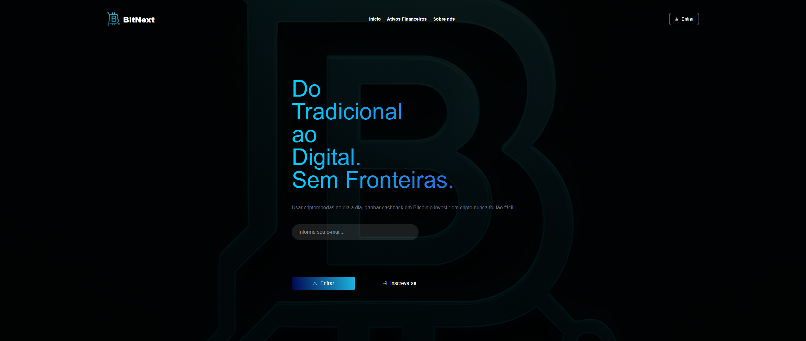
    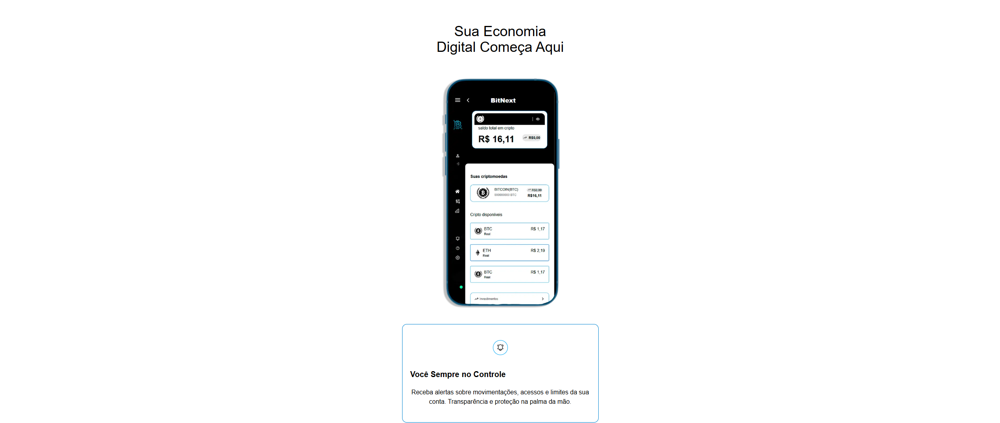
    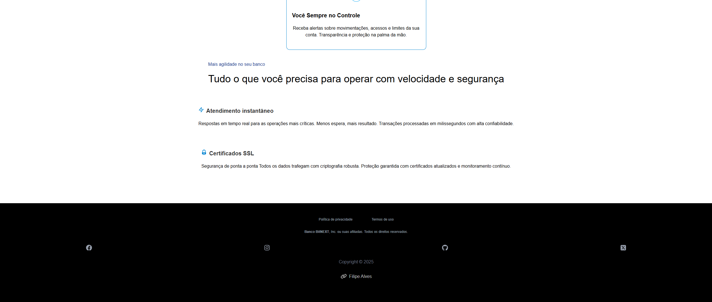
    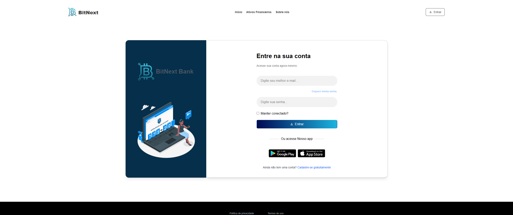
    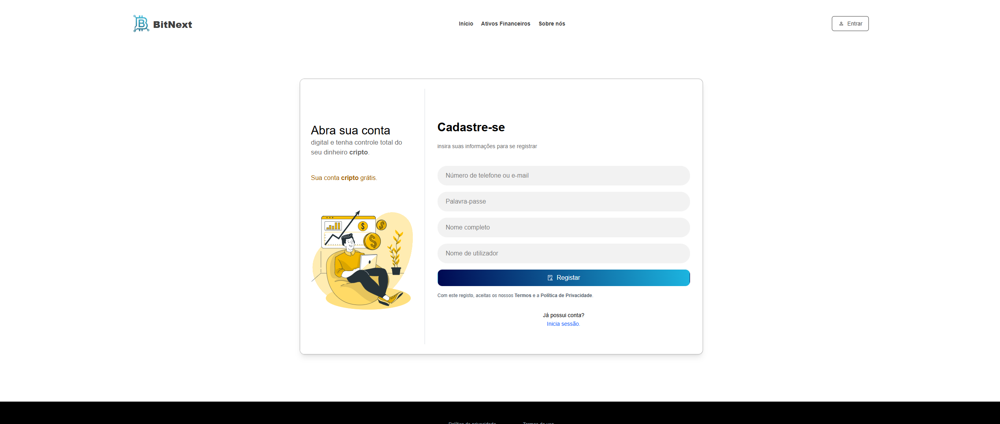
    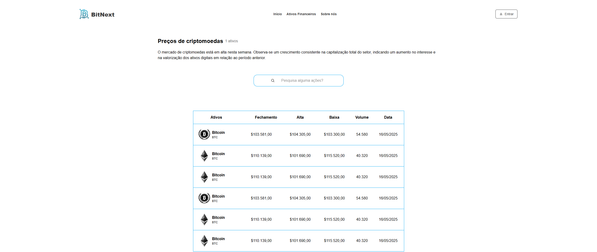
    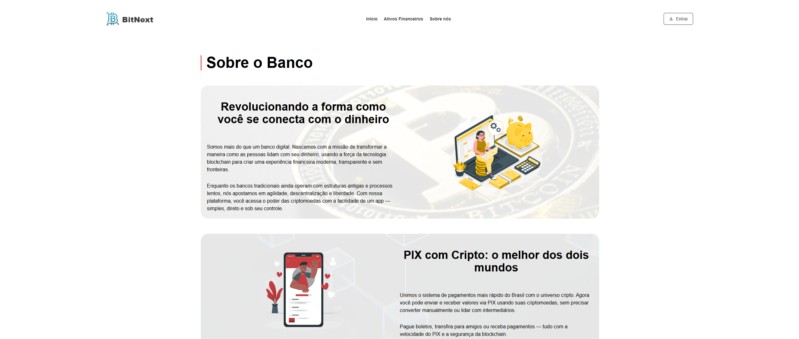
    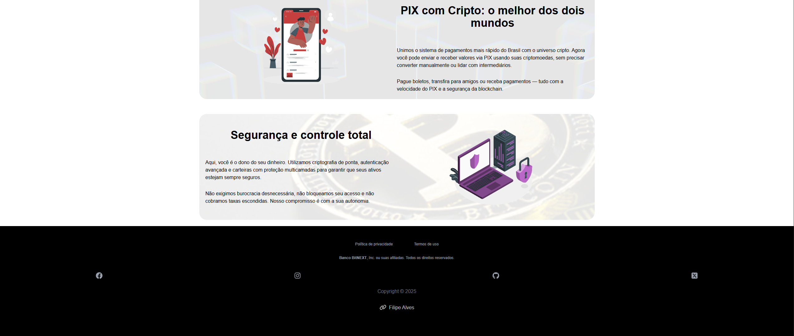
    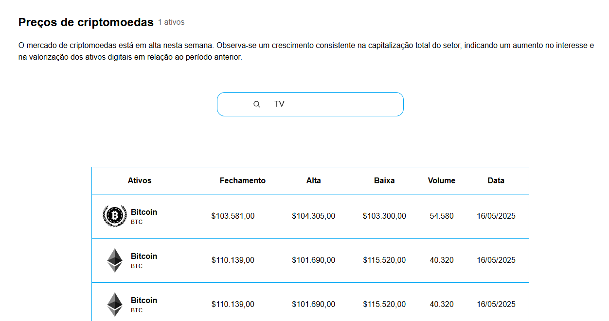
    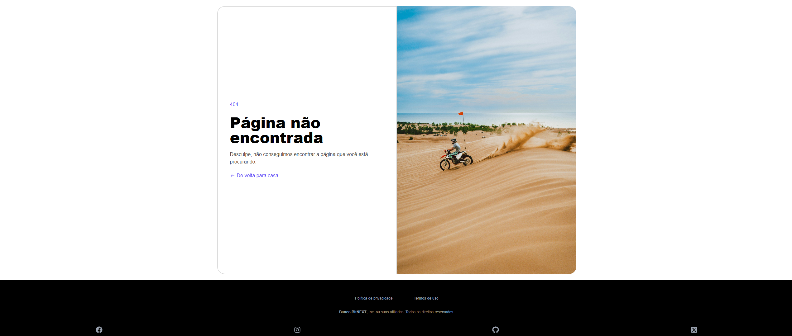
    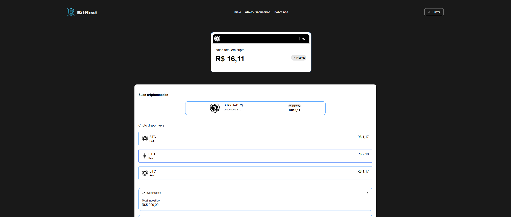
    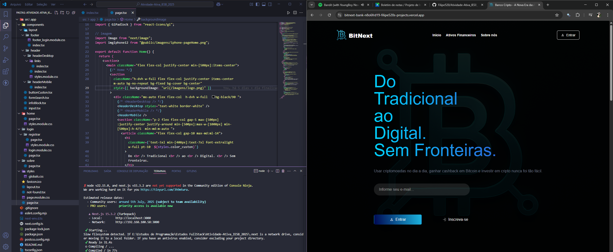
</div>

---

- [Acesse o site](https://atividade-ativa-iesb-2025-pisu.vercel.app/)
- [Repositório no GitHub](https://github.com/Filipe520/Atividade-Ativa_IESB_2025)

---

## Sobre o Projeto

Este é um projeto [Next.js](https://nextjs.org) criado com [`create-next-app`](https://nextjs.org/docs/app/api-reference/cli/create-next-app).

## Como Executar

Para iniciar o servidor de desenvolvimento:

```bash
npm run dev
# ou
yarn dev
# ou
pnpm dev
# ou
bun dev
```

Abra [http://localhost:3000](http://localhost:3000) no navegador para visualizar o resultado.

Edite a página modificando `app/page.tsx`. As alterações são aplicadas automaticamente.

Este projeto utiliza [`next/font`](https://nextjs.org/docs/app/building-your-application/optimizing/fonts) para otimizar e carregar a fonte [Geist](https://vercel.com/font).

## Saiba Mais

- [Documentação Next.js](https://nextjs.org/docs)
- [Tutorial Interativo Next.js](https://nextjs.org/learn)
- [Repositório Next.js no GitHub](https://github.com/vercel/next.js)

## Deploy

A maneira mais fácil de fazer deploy do seu app Next.js é usando a [Vercel](https://vercel.com/new?utm_medium=default-template&filter=next.js&utm_source=create-next-app&utm_campaign=create-next-app-readme).

Veja a [documentação de deploy do Next.js](https://nextjs.org/docs/app/building-your-application/deploying) para mais detalhes.
